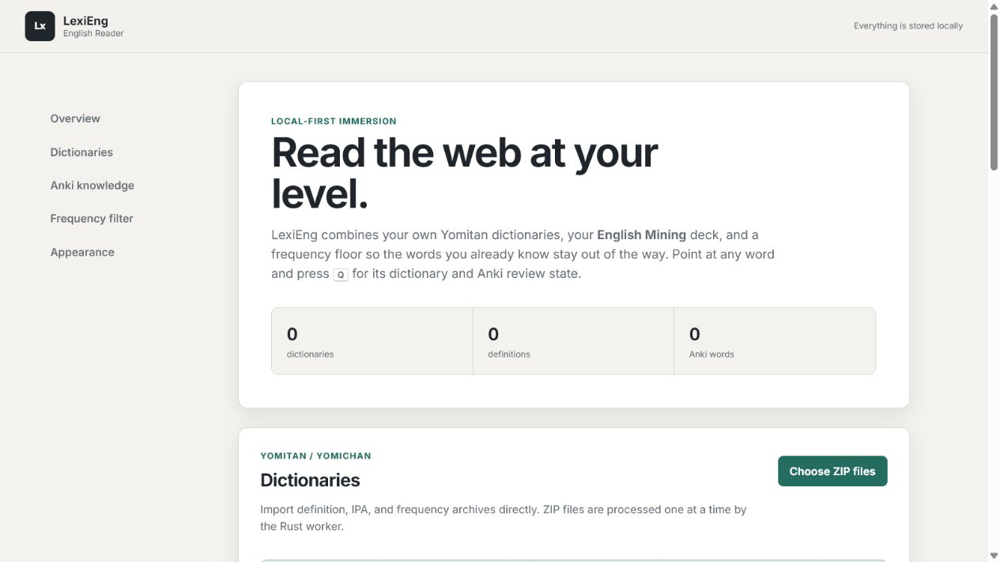

# LexiEng

LexiEng is a fast, local-first English immersion reader for Chrome and Microsoft Edge. It brings together your own Yomitan/Yomichan dictionaries, the words already in your Anki mining deck, and frequency-rank filtering so familiar vocabulary stays out of the way.



The workflow is inspired by [JitenReader](https://github.com/Sirush/JitenReader), but LexiEng is an independent English-focused implementation. Its parsing and dictionary core is written in Rust and compiled to WebAssembly.

## What it does

- Imports multiple Yomitan/Yomichan ZIP dictionaries in one queue.
- Preserves plain and structured definitions, IPA metadata, and frequency metadata.
- Syncs known terms and per-card scheduling snapshots from an Anki deck through AnkiConnect. The default deck is `English Mining`.
- Auto-detects common fields such as `Word`, `Expression`, `Term`, `Vocabulary`, and `Front`, or lets you choose a field explicitly.
- Excludes frequency ranks 1–20,000 by default, with editable minimum and maximum target ranks.
- Opens the local dictionary for the word under the pointer with `Q`, even before a page scan.
- Parses every English token on request and applies JitenReader-style New, Learning, Young, Mature, Due, Mastered, Suspended, frequency-known, and target states.
- Keeps parsing text added by article readers, subtitle tools, and single-page apps after the first parse.
- Shows Anki card state, current interval, reviews, and lapses alongside real grading controls.
- Sends deliberate Again, Hard, Good, or Easy grades through Anki’s own scheduler; keys `1`–`4` work while the popup is open.
- Mines unknown words, local definitions, IPA, frequency, and the surrounding sentence into the configured Anki note type.
- Provides an in-page coverage/status bar with parse, reader, mass-review, clear, and settings controls.
- Opens extracted article content in a focused reader view and parses it immediately.
- Uses a compact toolbar widget like JitenReader. There is no side panel.
- Keeps manual known-word overrides without changing Anki notes.
- Includes Default, Sepia, Rosé Pine, Nord, Catppuccin Mocha, and Monochrome themes.
- Uses a bundled Inter variable font with Noto Sans JP, Yu Gothic UI, and Meiryo fallbacks.
- Contains no telemetry, advertising, cloud API, remote code, animation, or gradient styling.

## Install from a release

1. Download `lexieng-v*-chromium.zip` from the [releases page](https://github.com/VoxNut/LexiEng/releases).
2. Extract it to a permanent folder.
3. Open `chrome://extensions/` in Chrome or `edge://extensions/` in Edge.
4. Enable **Developer mode**.
5. Choose **Load unpacked** and select the extracted folder containing `manifest.json`.
6. Pin LexiEng and click its toolbar icon to open the compact command widget.

Chrome or Edge 116 and newer are supported.

## First setup

### 1. Import dictionaries

Open LexiEng settings and drag all of your dictionary ZIPs onto the Dictionaries section. The importer accepts standard Yomitan formats 3 and 4 and detects content by archive structure, not filename.

It supports the structures used by:

- yzk English frequency lists
- seth OALD IPA and extra data
- Cambridge Dictionary
- COBUILD Advanced Learner's Dictionary
- Oxford Dictionary of English and OALD 10
- Hackterms
- Macmillan with IPA
- プログレッシブ英和中辞典
- Urban Dictionary
- wty English and IPA packs
- Từ điển Lạc Việt

No dictionary data is included in this repository. You are responsible for obtaining and using dictionary files under their respective licenses.

Large collections can contain millions of entries and take several minutes to import. Keep the settings tab open until the queue finishes. Each archive is decompressed one bank at a time in a dedicated Rust/WASM worker and committed to IndexedDB in 750-row batches.

### 2. Sync Anki knowledge

1. Install [AnkiConnect](https://git.sr.ht/~foosoft/anki-connect) and keep Anki open.
2. Leave the endpoint at `http://127.0.0.1:8765` unless your AnkiConnect configuration uses another URL.
3. Enter `English Mining` or select another discovered deck.
4. Test the connection and choose the field containing the headword. **Detect automatically** prefers a field named `Word`.
5. Choose **Sync words + schedules**.

Sync reads `findCards` and `cardsInfo`, then replaces only LexiEng’s local Anki snapshot. Manual known words remain intact. A lookup’s review buttons call AnkiConnect’s `answerCards` only after you click a grade; the resulting interval is calculated and stored by Anki’s active scheduler. **Add to Anki** deliberately creates a new note using the configured field mapping. LexiEng never edits or deletes existing notes. If AnkiConnect rejects the extension origin, add the installed `chrome-extension://<extension-id>` origin to AnkiConnect's `webCorsOriginList` and restart Anki.

### 3. Set the frequency range

The defaults are:

| Setting | Default | Effect |
| --- | ---: | --- |
| Known ceiling | 20,000 | Ranks 1–20,000 are treated as familiar |
| Target start | 20,001 | First rank eligible for marking |
| Target end | 100,000 | Last rank eligible for marking |
| Unranked words | Included | Technical and uncovered vocabulary can still be marked |

Anki and manual known-word status always win over the frequency range. When several frequency dictionaries are enabled, choose one explicitly or let LexiEng use the best available rank.

## Reading workflow

1. Open a normal web page.
2. Point at a word and press `Q` to open its local definitions, IPA, frequency, Anki state, and review controls. This works before parsing.
3. Parse the page with the toolbar widget, context menu, in-page status bar, or `Alt+P`. If text is selected, `Alt+P` parses only that selection.
4. Press `Q` or click any parsed word. Enable hover lookup in settings if desired.
5. If the word has an Anki card, click Again, Hard, Good, or Easy—or press `1`, `2`, `3`, or `4`—to review it through Anki’s active scheduler.
6. If it is unknown, click **Add to Anki** to create a mining note with the surrounding sentence and imported dictionary data.
7. Press `Alt+H` for reader mode, `Alt+L` to look up selected text, or `Alt+S` to toggle the status bar.
8. Use the status-bar **Review** action to grade eligible visible cards as Good in one confirmed batch.

Parsing remains explicit, but once enabled LexiEng observes newly added text and parses it in bounded batches. The `Q` lookup still examines only the word at the pointer when the page has not been parsed.

## Build from source

Requirements:

- Node.js 22+
- Rust 1.85+
- the `wasm32-unknown-unknown` Rust target
- `wasm-bindgen-cli` 0.2.105

```powershell
rustup target add wasm32-unknown-unknown
cargo install wasm-bindgen-cli --version 0.2.105 --locked
npm install
npm run check
npm run build
```

Load the generated `dist/` folder as an unpacked extension. To create the release archive:

```powershell
npm run package
```

The ZIP is written to `packages/`.

## Architecture

```text
Web page content script
        ├── trigger + dynamic parsers
        ├── word-state highlighter
        ├── shadow-DOM dictionary / Anki popup
        ├── in-page status bar
        └── focused reader mode
                    │ text batches
                    ▼
Manifest V3 service worker ── Rust/WASM tokenizer + inflection candidates
        ├── IndexedDB: dictionary terms, IPA/frequency metadata, known words, Anki schedules
        ├── chrome.storage.local: small user settings
        └── AnkiConnect: sync, mining, grading, and mass review

Settings page
        ├── Dedicated Rust/WASM ZIP worker ── bounded import batches ── IndexedDB
        └── dictionary, Anki, parser, popup, status, review, reader, and theme configuration
```

JavaScript handles browser APIs, IndexedDB, safe DOM rendering, and UI. Rust handles Unicode tokenization, normalization, inflection candidates, ZIP decompression, Yomitan bank parsing, and frequency extraction.

Structured dictionary content is rendered through an element/style allowlist; raw dictionary HTML is never injected. Manifest V3 permits only code packaged with the extension.

The exact JitenReader behavior being adapted, plus intentional English-specific differences, is tracked in [docs/JITEN_PARITY.md](docs/JITEN_PARITY.md).

## Verification

```powershell
npm run typecheck
npm test
cargo test --workspace
npm run build
npm run verify:dictionary -- path\to\dictionary.zip
```

The importer has also been exercised against multi-million-row real-world English dictionary collections. An ignored Rust compatibility test can validate a local folder without committing dictionary data:

```powershell
$env:LEXIENG_DICTIONARY_DIR='D:\path\to\yomitan-zips'
cargo test --release validates_external_archive_directory -- --ignored --nocapture
```

## Privacy and permissions

See [PRIVACY.md](PRIVACY.md) for the complete policy and permission rationale. In short: page text, dictionaries, and known words remain on your device; only the AnkiConnect endpoint you configure receives requests, and those requests stay on localhost by default.

## Contributing

Issues and focused pull requests are welcome. Read [CONTRIBUTING.md](CONTRIBUTING.md) before changing storage schemas or the Rust/JavaScript boundary.

LexiEng is available under the [MIT License](LICENSE). The bundled Inter font is licensed separately under the [SIL Open Font License 1.1](LICENSES/Inter-OFL.txt).
